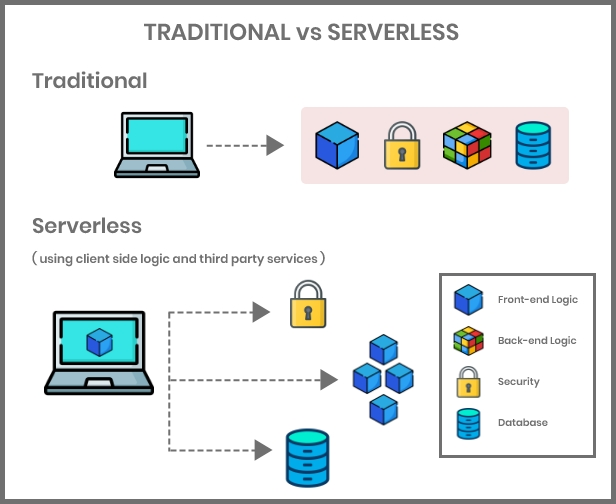
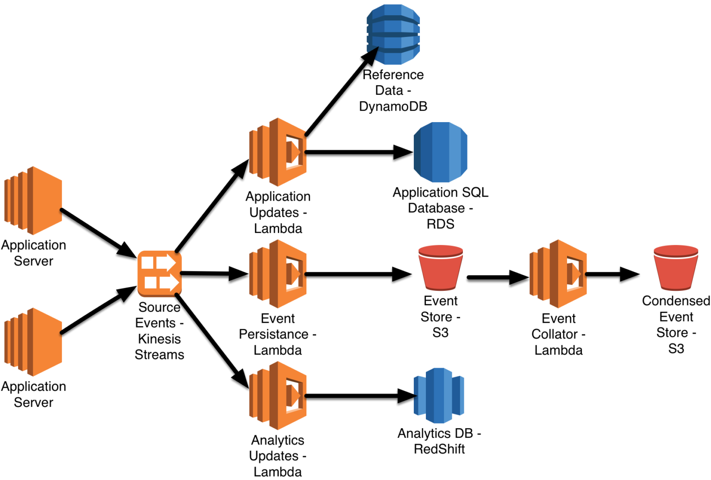
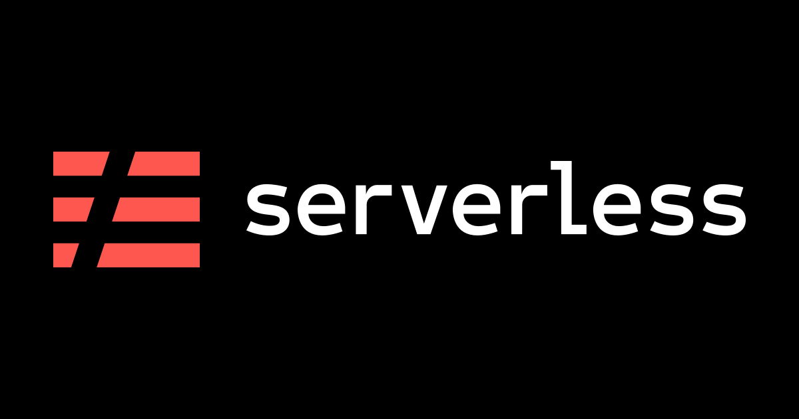

ServerLess
-------------------------------

Welcome to the world of Serverless.

In this course, you'll learn the following topics:

What is Serverless?
Why Serverless?
What makes your application Serverless?
Can't wait? Let's dive in.

Prior knowledge of AWS lambda or similar cloud platform is required for this course.

### Why Serverless?

Before learning anything, motivation to learn it is essential. This card will try to give you the motivation.

 -------------------------------------------

* Now, consider you are a developer, and you are developing next-generation software.

* Meanwhile, you want to test how it works in production, but you don't want to spend your precious time setting up deployment environment.

### Why Serverless?

You have a fantastic web application that receives non-linear traffic, and you cannot keep an eye on your server always. It would be best if you had someone to `auto scale `(scale up and down) your application.
  
------------------------------  

If you are facing any of the above problems, you are in the right place.

`Yes`. You guessed it right. `Serverless` is your one-stop solution.

### What is Serverless?

`Serverless` is a computing model where the `cloud 
service provider` is responsible for managing the piece of code without the developer having to bother about the `infrastructure setup` and management.

#### ** Fact ** 

Just like wireless internet with wires somewhere, serverless architectures still use servers somewhere.

#### *** Motto of Serverless ***

Focus on your software or application, not on infrastructure.


### What Makes Your Application Serverless?
The below-given properties make your application `Serverless`.

* `Zero Administration`: Deploy application without any provision and management.

* `Auto Scale`: Let service provider worry about scaling the application up or down.

* `Pay-per-use`: Pay only for the resources, what you have used.

* `Increased Velocity`: Shorten the time between idea implementation and deployment.

### Serverless vs Traditional Architecture




`Serverless` is also known as `Function as Service`, because each part of your application is divided as functions and can be hosted over multiple service providers.

Whereas, in the case of traditional applications, an application is treated as a whole.


### Serverless Application Architecture



Serverless applications are usually divided as separate units/functions based on their functionalities.


## Serverless Framework

### Serverless Platform

* Serverless itself is not a product. It is just a concept.
* Many cloud providers have invested many resources into it to provide a cloud serverless platform.
* Serverless cost model is that you are charged based on the number of executions.
* Providers allow your functions to respond to events such as image upload to S3 bucket.

### Serverless Providers

Many cloud vendors provide Serverless architecture. Some of them are:

* AWS Lambda
* Google Cloud Functions
* Azure Functions
* IBM OpenWhisk
* Alibaba Function Compute
* Iron Functions
* Auth0 Webtask
* Oracle Fn Project and many more....


### Serverless Framework



* Even though, cloud providers provide the platform to execute your functions, it is difficult to deploy and manage those functions manually.
* In future, if you plan to change your provider, you will be required to do a lot of configuration to achieve that.

This is where `Serverless Framework` comes in handy.

--------------------------

`Serverless Framework` is an open source `CLI` tool that helps to deploy and manage serverless functions.


### Serverless Framework Features

* `Infrastructure as Code`: Serverless framework allows you to define entire application configuration in a `yaml` file to utilize the power of cloud providers such as AWS lambda.
* `Simple Serverless Development:` Serverless framework provides a simple CLI to deploy and manage your serverless functions.
* `Provider Agnostic:` Serverless Framework is one tool solution to all cloud providers.

We use `Serverless CLI` to manage Serverless functions.


## Serverless CLI Installation

Serverless CLI is an npm package that should be installed globally to access the CLI.

---------------------

Steps:

* Install NodeJS on your system.
`Azure Functions Serverless Framework` plugin requires Node v6.5.0.

* Execute node --version to verify you have the proper NodeJS installed.

* Now install serverless using,

`npm install -g serverless
`

* Verify the installation by running sls --help.

#### Note : sls is a shorthand command for serverless.

### Credential Setup

For `Serverless CLI` to work,

* You must have a cloud provider like `AWS` or `Azure` that provide the serverless environment.
* You must allow `Serverless CLI` access to your account through `IAM, Service Principal or similar mechanisms`.


### Serverless Framework Configuration for AWS

Configuring the Serverless Framework for AWS involves defining your AWS service configuration in the `serverless.yml` file. Here's a basic example of a `serverless.yml` configuration for deploying a simple AWS Lambda function:

```yaml
service: my-serverless-service
provider:
  name: aws
  runtime: nodejs14.x
  stage: dev
  region: us-east-1

functions:
  hello:
    handler: handler.hello
```

Let's break down this configuration:

- `service`: This is the name of your service. You can choose any name for your service.

- `provider`: This section specifies the AWS provider configuration.
  - `name`: The provider's name is "aws."
  - `runtime`: The runtime for your Lambda functions (e.g., `nodejs14.x` for Node.js 14).
  - `stage`: The deployment stage (e.g., `dev` for development).
  - `region`: The AWS region where your service will be deployed (e.g., `us-east-1`).

- `functions`: This section defines the AWS Lambda functions in your service.
  - `hello`: The name of the Lambda function.
    - `handler`: The path to the function handler. In this example, it's pointing to a `handler.js` file and a `hello` function.

You can add more functions, events, and other AWS resources to your `serverless.yml` as needed.

Here's an example that includes an HTTP event trigger:

```yaml
service: my-serverless-service
provider:
  name: aws
  runtime: nodejs14.x
  stage: dev
  region: us-east-1

functions:
  hello:
    handler: handler.hello
    events:
      - http:
          path: hello
          method: get
```

In this updated configuration:

- The `hello` function now has an HTTP event trigger, which listens for GET requests on the `/hello` path.

Once you've configured your `serverless.yml` file, you can deploy your service to AWS using the `serverless deploy` command. The Serverless Framework will handle creating the necessary AWS resources, including Lambda functions, API Gateway, and more, based on your configuration.

Remember to replace the service name, runtime, stage, region, and function details with your specific requirements. The Serverless Framework provides extensive documentation for more advanced configurations and features, such as environment variables, custom resources, and plugins.


## ServerLess : Core Concepts

### Serverless Yaml

Examine the boilerplate.

* cd into <my-service-path>.
* Type ls to list the files in the directory.

    You should see,

        handler.js
        package.json
        serverless.yml

* handler.js is the file where your actual code goes.
* package.json is NodeJS specific dependency management file.
* serverless.yaml is the one doing all magic.

    - It specifies the functions, events, and much more.


Now, let's observe the default serverless.yaml.
```yaml
service: my-some-unique-name  #service name that you have given
provider:
  name: azure
  location: West US
plugins:
  - serverless-azure-functions
functions:
  hello: #default function
    handler: handler.hello 
    events:
      - http: true
        x-azure-settings:
          authLevel : anonymous
      - http: true
        x-azure-settings:
          direction: out
          name: res
```
So let's understand each field in the serverless.yaml.

    This is a minimal configuration file. There are many other fields to be added.


Responsibilities of serverless.yaml file are:

1. Declare a service.
2. Define the service provider such as AWS or Azure.
3. Define functions for the service.
4. Define plugins used.
    - Define events that trigger each function.
    - Allow events to create resources automatically.


#### Services

Service is a top-level object in `serverless.yaml` file.

```yaml
service: my-some-unique-name 
.
.
.
```
- Service is like a project.
- It is where you are supposed to specify functions, events that trigger those functions and resources used by the function.


#### Functions

- Functions are basic unit of deployments.
- Functions are piece of codes that are supposed to perform one single task.
- All functions should be written under functions section of serverless.yaml.
```yaml
.
.
.
functions:
  hello:
     handler: templates/handler.hello
     events:
       - http: true
         x-azure-settings:
           authLevel : anonymous 
           
```

#### Observe the below given serverless.yaml file.

```yaml
...
functions:
  functionOne:
    handler: handler.functionOne
    description: optional description for your Function
  functionTwo:
    handler: handler.functionTwo
  functionThree:
    handler: handler.functionThree

```

- handler: section points to the file which contains the function you want to run.
- You can add multiple functions under functions sections.

#### Events

- Events make it possible to run functions based on certain conditions.
- Simply put, events trigger functions.
- Events can be anything that triggers your functions. Events can be,
    - HTTP triggers
    - Blog updates
    - Message queues
    - cron-scheduled events 


Observe the below given serverless.yaml.
```yaml
...
# 'functions' in serverless.yml
functions:
  createUser: # Function name
    handler: handler.createUser # Reference to file handler.js & exported function 'createUser'
    events: 
      - http: true

```
- Events: section lists all the events associated with the function.

#### Serverless Events

Serverless events are the triggers or stimuli that initiate the execution of functions in a serverless computing environment. In serverless computing, functions are designed to be event-driven, responding to various types of events that can come from different sources. These events can be external requests, changes in data, or scheduled tasks. Here are some common types of serverless events:

1. **HTTP Events:** These are often the entry point for serverless applications. HTTP events are generated when a client sends an HTTP request to an API endpoint associated with a serverless function. The function is triggered and processes the request.

2. **Database Events:** Serverless functions can be triggered by changes in databases. For example, AWS Lambda can be triggered when a new record is added to a DynamoDB table or when data is updated in an RDS database.

3. **File Upload/Download Events:** Events can be generated when files are uploaded to or downloaded from cloud storage services like Amazon S3. Functions can process these events, such as resizing images upon upload.

4. **Message Queue Events:** Serverless functions can listen to message queues like AWS SQS, Azure Queue Storage, or Google Cloud Pub/Sub. When a message is placed in the queue, a function is triggered to process it.

5. **Scheduled Events:** Functions can be executed on a schedule, like cron jobs. You can schedule a function to run at specific intervals or times, making it useful for periodic tasks like data backups or cleanup.

6. **Authentication Events:** Events can be triggered when users authenticate or log in. For example, a function can be triggered when a user successfully logs in, allowing you to perform custom authentication-related tasks.

7. **IoT Events:** Serverless platforms often integrate with IoT services. Events can be triggered by data from IoT devices, allowing you to process and react to real-time sensor data.

8. **Custom Events:** You can define custom events specific to your application. For example, an e-commerce application might trigger events when orders are placed, payments are processed, or products are restocked.

9. **CloudWatch Events:** Cloud providers offer event-driven monitoring services like AWS CloudWatch Events or Azure Monitor, which can trigger serverless functions based on changes in the cloud environment, such as resource provisioning or security events.

10. **Third-Party Integration Events:** Serverless platforms offer integration with various third-party services and APIs. Events can be generated from these services, allowing you to automate workflows or react to external changes.

These events are central to the event-driven architecture of serverless computing. Functions are associated with event sources, and when an event occurs, the corresponding function is automatically invoked to handle the event. This architecture enables highly scalable and responsive applications, as functions are invoked on demand in response to real-time events.


### Plugins
Plugins are Javascript codes that provide additional capabilities to serverless framework by adding a new or extending the existing command.

----------------------

serverless.yaml file has a section for these plugins.

```serverless.yml```
```yaml

plugins:
  - serverless-plugin-identifier
  - serverless-another-plugin
  
```


### Serverless Variables

#### Variables Introduction

Serverless framework allows you to add dynamic data into serverless.yaml. They are known as Variables of Serverless Framework.

They help in separation of concerns. You can keep your dynamic data separate from the configuration file.

#### Variables
Serverless variables allows you to,

- Load data from environmental variables.
- Reference and load variables through CLI options.
- Refer the same serverless.yml file and fetch data from some other properties.
- Access data from YAML/JSON files.
- Combine variable references and overwrite each other.

#### Reference to Serverless Yaml
- You can access the value of any property from the same serverless yaml file.
- We use ${self:someProperty} syntax to access the value of someProperty.

```yaml
service: my-service
provider: azure
custom:
  schedule: cron(0 * * * *)

functions:
  hello:
    handler: handler.hello
    events:
      - timer: ${self:custom.schedule}
  fresco:
    handler: handler.fresco
    events:
      - timer: ${self:custom.schedule}
```

The above file -timer refers data from custom.schedule.


#### Refer External Files

- Serverless allows you to refer variables from external json,yaml or js files.
- To refer a variable in yaml file, use the syntax `${file(../filename.yml):someProp}`.
- To refer a variable in json file, use the syntax `${file(../filename.json):someProp}`.
- It is important to specify relative path and proper file extension.

#### Refer yaml/json Files

Consider the below-given example to understand how to refer external variables.
```yaml
# customFile.yml

cron: cron(0 * * * *)
```

The above file specifies a yaml property cron with value cron(0 * * * *).


#### Refer yaml/json Files
serverless.yaml corresponding to the custom file is given below.
```yaml
# serverless.yml

service: my-service
provider: azure
custom: ${file(../customFile.yml)} 
functions:
  hello:
    handler: handler.hello
    events:
      - timer: ${file(../customFile.yml):cron}property
  fresco:
    handler: handler.fresco
    events:
      - timer: ${self:custom.cron} 
```

Observer how,

- custom section is referring to the entire file content.
- timer section of hello function is referring to the particular property.
- timer section of fresco function is referring to the self:cutom which in turn is referring to the file.


#### Refer Js File

- Just like yaml and json you can also use javascript file to provide variables to serverless.yaml.
- You can use ${file(../someFile.js):someModule} syntax to access it in serverless.yaml.
Consider the below give js file.
```js
// config.js
module.exports.cron = () => {
   return 'cron(0 * * * *)';
}
```

You can use both named and unnamed exports.

The given serverless.yaml file uses config.js file, defined earlier.
```yaml
# serverless.yml
service: new-service
provider: azure

functions:
  hello:
      handler: handler.hello
      events:
        - timer: ${file(../config.js):cron} 

```

- timer section refers to the cron property defined in the file config.js.

#### Multiple Configuration Files
When you are using serverless for your real-world application, you would require to use many resources,events and many more in your serverless.yaml.

This will bloat your serverless.yaml and thereby decreasing the readability of the file.

To make your serverless.yaml file reader-friendly, you can go with external files to declare those resources or events.

e.g.;

    resources:
    Resources: ${file(azure-resources.json)}

The above serverless.yaml file loads Resources from file azure-resources.json.

## Serverless CLI
### Serverless CLI Introduction
* As mentioned earlier, Serverless is a CLI tool.
* Serverless provides you with various commands that can be used to deploy and manage your serverless functions.
* Serverless commands can be extended using plugins.
* New commands can be added using plugins.

### AWS - Config
* The purpose of serverless config is to allow to enable or disable automatic update mechanism of the Framework. 

* Turn on auto update mechanism

```
serverless config --autoupdate
```

* Turn off auto update mechanism
```
serverless config --no-autoupdate
```

### AWS - Config Credentials

```
serverless config credentials --provider provider --key key --secret secret
```
#### Options

  * --provider or -p The provider (in this case aws). Required.

  * --key or -k The aws_access_key_id. Required.

  *  --secret or -s The aws_secret_access_key. Required.

  * --profile or -n The name of the profile which should be 
    created.

  * --overwrite or -o Overwrite the profile if it exists.


#### Configure the default profile
```
serverless config credentials --provider aws --key 1234 --secret 5678
```
This example will configure the default profile with the aws_access_key_id of 1234 and the aws_secret_access_key of 5678.

#### Update an existing profile

```
serverless config credentials \
  --provider aws \
  --key 1234 \
  --secret 5678 \
  --profile custom-profile \
  --overwrite
```

This example overwrite custom-profile profile with the aws_access_key_id of 1234 and the aws_secret_access_key of 5678.

### AWS - Create

Creates a new service in the current working directory based on the provided template.

#### Create a service in the current working directory:
```
serverless create --template aws-nodejs
```
#### Create a service in a new folder:
```
serverless create --template aws-nodejs --path myService
```
#### Create a service in a new folder using a custom template:

```
serverless create \
  --template-url https://github.com/serverless/serverless/tree/master/lib/plugins/create/templates/aws-nodejs \
  --path myService

```
#### Options

* --template or -t The name of one of the available templates. Required if --template-url and * --template-path are not present.
* --template-url or -u A URL pointing to a remotely hosted template. Required if --template and --template-path are not present.
* --template-path The local path of your template. Required if --template and --template-url are not present.
* --path or -p The path where the service should be created.
* --name or -n the name of the service in serverless.yml.


#### Creating a new service

```
serverless create --template aws-nodejs --name my-special-service
```
This example will generate scaffolding for a service with AWS as a provider and nodejs as runtime. The scaffolding will be generated in the current working directory.

### Serverless Install
install command of serverless framework will install a service from a git repo.

* This command downloads service from https://github.com/some/service and puts in the current directory.
```
sls install --url https://github.com/some/service
```
#### Options:

* --url or -u: Service's GitHub URL. It is a required attribute.
* --name or -n: Service name.


### Serverless Deploy
sls deploy deploys entire service to the cloud.

To deploy entire service, use the below-given command.
```
sls deploy
```
#### Options

* --noDeploy or -n: Skips deployment steps and puts artifacts in the .serverless directory.
* --verbose or -v: Shows all events during deployment.
* --function or -f: If your changes are function level, i.e., you have not made any changes to serverless.yaml, then go with this argument. This will only deploy the specified function.
```
sls deploy function -f myFunction 
```

### Serverles Invoke
sls invoke command invokes a functions and prints its results.

The below command invokes fnName function and prints its result to the terminal.
```
sls invoke --function fnName
```
#### Options

* --function or -f : Function name to be invoked. This argument is required.
* --path or -p: Specifies json file path which has input data to be sent to the invoked function.


### Plugin Commands
Serverless plugins can be managed using CLI.

-----------------

- To list all plugins in plugins repository,
```
sls plugin list
```
- To search for a specific plugin,
```
sls plugin search --query <plugin_name>
```
- To install a plugin,
```
sls plugin install --name pluginName
```
- If you want a specific version then use <pluginname>@<version>.

- To uninstall a plugin,
```
sls plugin uninstall --name pluginName
```
### Serverless Print
print command prints serverless.yaml.
e.g.,
```
sls print
```
#### Options

* --format: To format configuration in given format ("yaml", "json", "text"). Default is yaml.
* --path: To print any sub-value. (eg: "provider.name").
* --transform: Transform-function to be applied to the value (only "keys" is supported).


### ServerLess Events

In the context of the Serverless Framework and serverless applications, "events" refer to the triggers or sources of input that initiate the execution of a serverless function or service. Events are crucial for defining when and how serverless functions should run. Here are some key notes on serverless events:

1. **Event-Driven Architecture:** Serverless applications are designed around an event-driven architecture. Events can be various types of actions or occurrences, such as HTTP requests, changes in data, file uploads, database updates, and more. These events trigger serverless functions to respond.

2. **Supported Event Sources:** The Serverless Framework provides support for various event sources, depending on the cloud provider you're using. Common event sources include:

   - **HTTP Endpoints:** Events can be triggered by HTTP requests, making serverless functions accessible via web APIs.
   - **Scheduled Events:** Functions can be triggered at specified intervals, using cron expressions or similar scheduling mechanisms.
   - **Data Changes:** Events can be triggered when data in a database, such as AWS DynamoDB or Azure Cosmos DB, is modified.
   - **File Uploads:** Functions can be triggered when files are uploaded to cloud storage, like Amazon S3 or Azure Blob Storage.
   - **Custom Events:** You can define custom events and event sources using cloud-specific services or external integrations.

3. **Event Configuration:** When defining serverless functions in your serverless.yml (Serverless Framework configuration file), you specify the events that should trigger those functions. For example:

   ```yaml
   functions:
     myFunction:
       handler: handler.myFunction
       events:
         - http:
             path: /my-api-endpoint
             method: get
         - schedule:
             rate: cron(0 12 * * ? *)  # Trigger every day at 12 PM
   ```

4. **Serverless Providers:** Different cloud providers offer their own set of event sources. AWS, Azure, Google Cloud, and other providers have their unique services for triggering serverless functions.

5. **Event Payload:** Events typically come with a payload of data that can be processed by the serverless function. The payload might contain information about the event source, input parameters, and other relevant data.

6. **Handling Failures:** Serverless applications should be designed to handle failures gracefully. If an event-triggered function encounters an error, you can configure retries, error handling, and, in some cases, dead-letter queues to capture failed events for analysis.

7. **Scalability:** Serverless functions can scale automatically based on the volume of incoming events. The cloud provider manages the underlying infrastructure, ensuring that functions can handle high loads.

8. **Cost-Efficiency:** Serverless applications are often cost-efficient because you only pay for the actual execution time of functions. When no events are triggering functions, there are no associated costs.

9. **Logging and Monitoring:** Effective event handling requires robust logging and monitoring to track the execution of functions, troubleshoot issues, and gather insights about your serverless application's behavior.

In summary, serverless events are at the core of serverless architecture, allowing serverless functions to respond to external triggers and provide on-demand, event-driven functionality. These events play a crucial role in building responsive and cost-effective applications.


[Follow the link](https://www.serverless.com/framework/docs/providers/aws/guide/events)